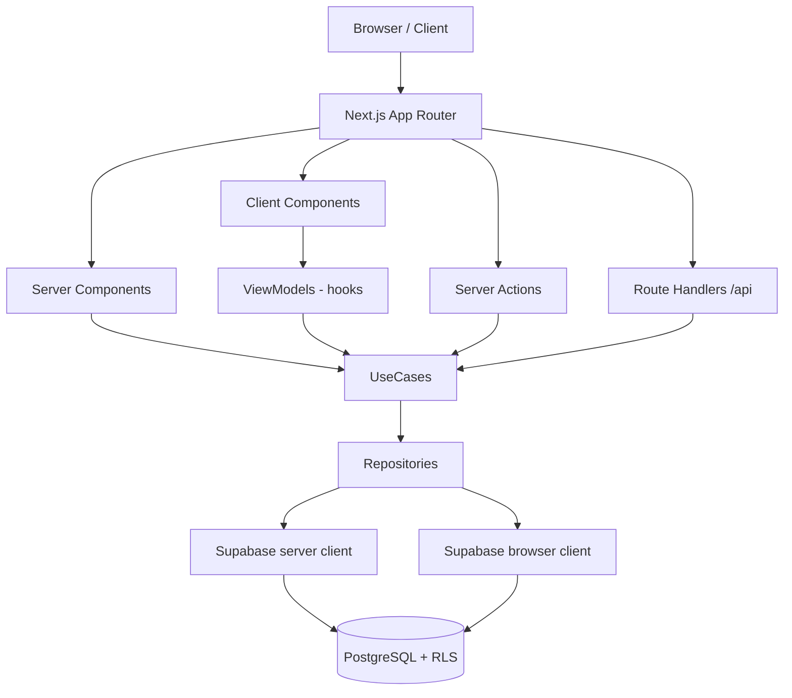

# 02 — Arquitetura do Sistema

## Tipo de arquitetura
**Clean Architecture + MVVM** aplicada a Next.js App Router.

## Camadas e responsabilidades

```
View (components/)
  ↓ props + callbacks
ViewModel (viewmodels/)         ← hooks de estado e apresentação
  ↓ chama UseCases
UseCase (usecases/)             ← regras de negócio
  ↓ chama Repositories
Repository (repositories/)      ← abstração de acesso a dados
  ↓ acessa
Supabase (lib/supabase/)        ← implementação concreta
```

### View — `src/components/`
- Apenas renderização e captura de eventos
- Nenhuma chamada direta ao Supabase
- Recebe dados via props ou ViewModel hook

### ViewModel — `src/viewmodels/`
- Custom hooks: `useContactsViewModel`, `useKanbanViewModel`, etc.
- Gerencia estado local (loading, error, dados exibidos)
- Chama UseCases — nunca repositórios diretamente
- Transforma dados de domínio em formato exibível

### UseCase — `src/usecases/`
- Uma classe ou conjunto de funções por domínio
- Orquestra repositórios, aplica regras de negócio
- Exemplos: `ContactUseCases`, `KanbanUseCases`, `AdminUseCases`

### Repository — `src/repositories/`
- Implementação concreta usando Supabase
- Toda query filtra por `workspace_id`
- Exemplos: `contact.repository.ts`, `deal.repository.ts`

### Infraestrutura — `src/lib/supabase/`
- `client.ts` — browser client (anon key + RLS)
- `server.ts` — server client (anon key + RLS)
- `admin.ts` — service_role, apenas para operações admin
- `middleware.ts` — renovação de sessão
- `cached-auth.ts` — cache de autenticação no servidor

## Fluxo de dados por tipo de componente

### Server Components (padrão para leitura)
```
Server Component → UseCase → Repository → Supabase (server client + RLS)
```
Sem round-trip no browser. Dados chegam prontos no HTML.

### Client Components (interatividade e realtime)
```
Client Component → ViewModel hook → UseCase → Repository → Supabase (browser client + RLS)
```

### Server Actions (mutações)
```
Form / Client Component → Server Action → UseCase → Repository → Supabase (server client + RLS)
```
Todos os `actions.ts` ficam no mesmo diretório da rota que os usa.

### Route Handlers (APIs REST internas)
```
Client → /api/... → Route Handler → UseCase ou direto → Supabase (server/admin client)
```
Atualmente apenas: `/api/address/cep` e `/api/auth` (callback)

## Diagrama de camadas



## Pontos fortes
- RLS é a última barreira — mesmo se o código falhar, o banco protege
- `workspace_id` nunca vem do cliente — sempre do contexto autenticado
- Server Actions substituem APIs desnecessárias, reduzindo surface de ataque
- Separação de camadas facilita testes unitários de UseCase e Repository

## Riscos arquiteturais

| Risco | Localização | Impacto |
|---|---|---|
| `service_role` usado em `audit_logs` e operações admin | `src/lib/supabase/admin.ts` | Controlado — mas precisa revisão a cada mudança |
| Chat placeholder (`/chat`) sem implementação | `src/app/(dashboard)/chat/page.tsx` | Usuário vê tela vazia |
| WA Integrations sem UI | Tabela existe, frontend ausente | Bloqueante para WhatsApp |
| Queries cross-domain (CRM ↔ wa_*) | Não implementadas ainda | Requer cuidado com RLS |

## Melhorias recomendadas
- Extrair interfaces de repositório (`IContactRepository`) para facilitar mocks em testes
- Implementar testes de ViewModel separados de testes de UseCase
- Documentar contrato de leitura CRM ↔ WA (quem lê `wa_*`, como, com qual client)
