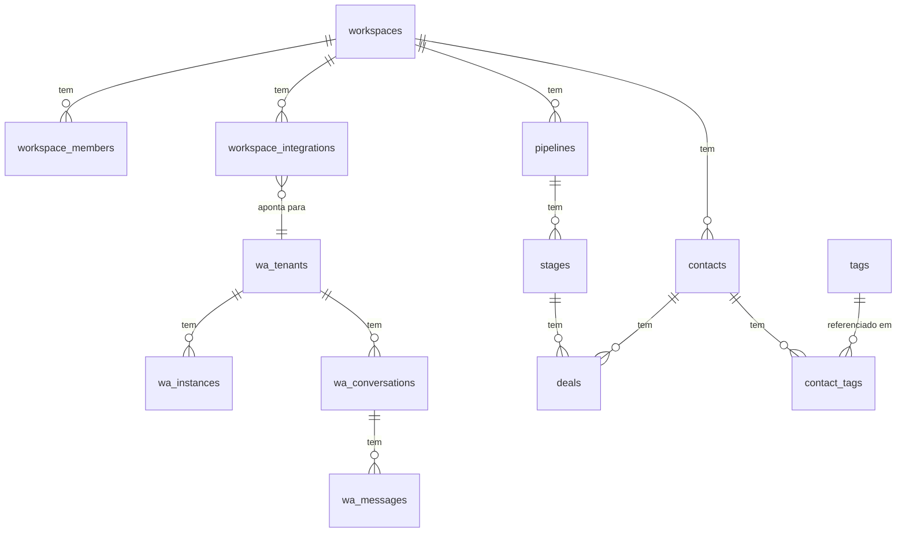

# 04 — Modelagem e Dados

## Estratégia de multi-tenant
Isolamento por `workspace_id` em todas as tabelas + **Row Level Security (RLS)** no PostgreSQL.
- `workspace_id` nunca vem do cliente — derivado do contexto autenticado (JWT/sessão)
- Função `my_workspace_ids()` (SECURITY DEFINER) centraliza a lógica de quais workspaces o usuário pode acessar

## Dois domínios no mesmo banco

O banco Supabase é **compartilhado** entre o CRM (este projeto) e o backend WhatsApp externo.
Separação por prefixo de nome de tabela:

- **Sem prefixo ou `auto_parts_/fashion_/auto_sales_`** → domínio CRM
- **Prefixo `wa_`** → domínio WhatsApp API (backend externo; CRM não escreve)

## Tabelas do domínio CRM

### Core / tenant

| Tabela | Finalidade |
|---|---|
| `workspaces` | Tenant — cada empresa cliente |
| `workspace_members` | Usuários por workspace com role |
| `workspace_roles` | Roles customizadas por workspace |
| `workspace_role_permissions` | Relação role ↔ permissão |
| `workspace_integrations` | Ponte CRM ↔ WA API por workspace |
| `profiles` | Perfil público do usuário (espelha `auth.users`) |
| `permissions` | Catálogo de permissões do sistema |
| `plans` | Planos de assinatura (Ponto em aberto: sem billing implementado) |
| `audit_logs` | Log de auditoria — append-only |
| `rate_limits` | Controle de rate limit por IP/email |
| `business_niches` | Catálogo hierárquico de nichos |

### Vendas / CRM

| Tabela | Finalidade |
|---|---|
| `pipelines` | Funis de venda por workspace |
| `stages` | Etapas de cada funil |
| `deals` | Negociações / cards do kanban |
| `deal_activities` | Histórico de atividades por deal |
| `contacts` | Leads e contatos |
| `contact_tags` | Relação contato ↔ tag |
| `tags` | Tags livres por workspace |

### Módulo Autopeças

| Tabela | Finalidade |
|---|---|
| `vehicle_brands` | Marcas de veículos (catálogo global) |
| `vehicle_categories` | Categorias de veículos |
| `vehicle_models` | Modelos por marca/categoria |
| `auto_parts_catalog` | Catálogo de peças por workspace |
| `auto_parts_compatibility` | Peça ↔ veículo compatível |
| `auto_parts_workspace_pricing` | Precificação por workspace |
| `auto_parts_quotes` | Orçamentos |
| `auto_parts_quote_items` | Itens de orçamento |
| `contact_profiles_auto_parts` | Perfil do contato para autopeças |

### Módulo Auto Sales

| Tabela | Finalidade |
|---|---|
| `auto_sales_inventory` | Estoque de veículos |
| `auto_sales_inventory_pricing` | Precificação do estoque |
| `auto_sales_optional_items` | Opcionais dos veículos |
| `auto_sales_proposals` | Propostas de venda |

### Módulo Moda

| Tabela | Finalidade |
|---|---|
| `fashion_products` | Produtos |
| `fashion_product_variants` | Variantes (cor, tamanho) |
| `fashion_variant_pricing` | Precificação por variante |
| `fashion_variant_stock` | Estoque por variante |
| `contact_profiles_fashion` | Perfil do contato para moda |

## Tabelas do domínio WhatsApp API (prefixo `wa_`)

CRM **lê** mas **não escreve** nessas tabelas. Gerenciadas pelo backend WA externo.

`wa_tenants`, `wa_tenant_members`, `wa_tenant_users`, `wa_providers`, `wa_instances`,
`wa_conversations`, `wa_messages`, `wa_contacts`, `wa_labels`, `wa_conversation_labels`,
`wa_conversation_status_history`, `wa_media`, `wa_message_events`, `wa_reactions`,
`wa_polls`, `wa_poll_votes`, `wa_templates`, `wa_automation_rules`, `wa_call_logs`,
`wa_presence_events`, `wa_raw_events`, `wa_pending_events`, `wa_webhook_metrics`,
`wa_daily_reports`, `wa_insights`, `wa_error_logs`, `wa_subscriptions`

## Ponte entre domínios

```
workspaces
    └──→ workspace_integrations (workspace_id + wa_tenant_id)
                └──→ wa_tenants
                          └──→ wa_instances
                          └──→ wa_conversations
                                    └──→ wa_messages
```

## Relações principais (ERD simplificado)



## Estratégia de migrations
34 arquivos SQL em `supabase/migrations/`, aplicados via `supabase db push`.
Nomenclatura: `YYYYMMDDHHMMSS_descricao.sql`

Primeiras migrations (2026-04): schema inicial, roles, contacts, settings, RLS policies
Migrations de módulos (2026-05-04): auto_parts, auto_sales, fashion, vehicle catalog, RLS por nicho
Migrations recentes (2026-05-20): drop conversations/messages, criação workspace_integrations

## RLS — Row Level Security
- Ativa em **todas** as tabelas CRM
- Políticas separadas por operação (SELECT / INSERT / UPDATE / DELETE)
- Tabelas `wa_*` sem RLS do CRM (gerenciadas pelo backend WA)

> **Risco identificado:** ausência de RLS nas tabelas `wa_*` é aceitável apenas enquanto o CRM não escreve nelas. Quando leitura cross-domain for implementada, revisar políticas.

## Pontos em aberto
- Schema de `plans` existe mas billing não está implementado
- `contact_tags` e `tags`: relação muitos-para-muitos correta, mas UI de tags incompleta
- `wa_*` sem contrato formal de leitura — ainda não definido qual client Supabase usará para queries cross-domain
